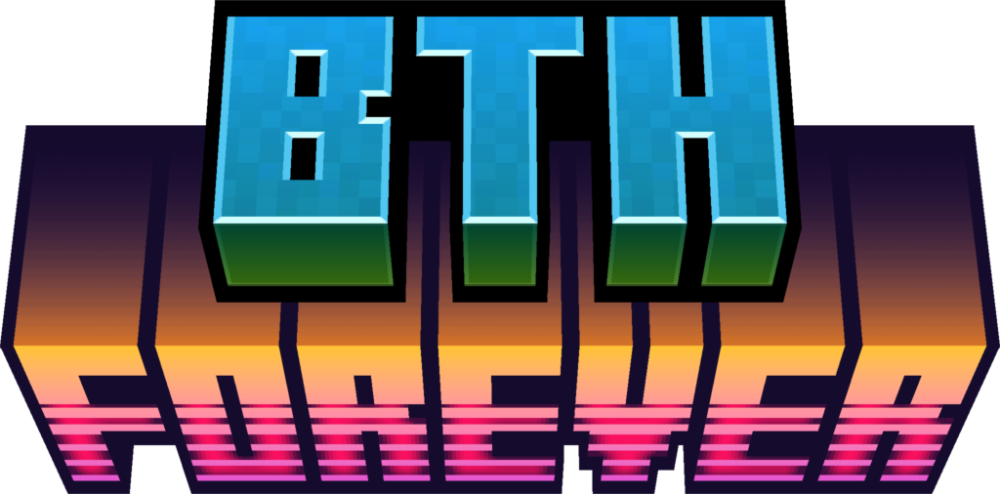

<div align="center">
  
</div>

<p align="center">A curated NeoForge Minecraft modpack, built with packwiz and released automatically to Modrinth.</p>

<p align="center">
  
  
</p>

---

## What is this?

**BTH Forever** is a Minecraft modpack maintained by **BTH Labs**. The modpack itself is
defined with [packwiz](https://packwiz.infra.link/), a lightweight, git-friendly format that
tracks each mod as a small `.pw.toml` reference rather than bundling the jars. This repository
holds that definition plus the GitHub Actions that build and publish it.

- **Minecraft:** 1.21.1
- **Loader:** NeoForge 21.1.233
- **Distribution:** [Modrinth](https://modrinth.com/) (a `.mrpack` is also attached to every GitHub release)

## Repository layout

```
BTH-Forever/            # the packwiz modpack
├── pack.toml           # pack metadata (name, version, MC + NeoForge versions)
├── index.toml          # packwiz file index — GENERATED, not committed (gitignored)
├── mods/               # one *.pw.toml per mod
├── config/             # bundled client configs
└── CHANGELOG.md        # used as the Modrinth changelog on release
flake.nix               # nix devShell that provides packwiz
.github/workflows/      # build + release automation
```

> **Why isn't `index.toml` committed, and why is `pack.toml`'s hash blank?** packwiz regenerates
> `index.toml` (and the `[index]` hash inside `pack.toml`) from the `mods/*.pw.toml` files on every
> `packwiz refresh`. If those generated values were committed, two people adding mods at the same
> time would conflict on the same lines. They are treated as build artifacts instead: `index.toml`
> is gitignored, and `pack.toml` is committed with an empty `hash = ""`. CI runs `packwiz refresh`
> before every build and release, so the real values are always recomputed. A guard step in
> `build.yml` fails the build if either generated value is ever committed.

## How releases work

The pipeline is two GitHub Actions workflows. Every action is pinned to a commit SHA for
supply-chain safety, and [Dependabot](.github/dependabot.yml) keeps those pins current.

### `build.yml`: continuous validation
Runs on every push to `main`, on pull requests, and on manual dispatch. It refreshes and
exports the pack with packwiz to catch broken mod metadata early, and uploads the resulting
`.mrpack` as a build artifact. No secrets, no publishing.

### `release.yml`: tag-triggered publish
Runs when a version tag is pushed. It:

1. Refreshes and exports the Modrinth `.mrpack` with packwiz (inside the nix devShell).
2. Derives the version and game version from the tag and `pack.toml`.
3. Creates a GitHub release with the `.mrpack` attached and auto-generated notes.
4. Publishes to Modrinth using [`mc-publish`](https://github.com/Kir-Antipov/mc-publish),
   with `BTH-Forever/CHANGELOG.md` as the changelog.

Tags with a pre-release suffix (e.g. `v1.0.1-rc1`) are published as a **beta**; clean tags
(e.g. `v1.0.1`) are published as a full **release**.

### Cutting a release

1. Update `version` in [`BTH-Forever/pack.toml`](BTH-Forever/pack.toml) and edit
   [`BTH-Forever/CHANGELOG.md`](BTH-Forever/CHANGELOG.md).
2. Commit, then tag and push:

   ```bash
   git tag v1.0.1
   git push origin v1.0.1
   ```

3. The `release.yml` workflow builds, releases, and publishes to Modrinth automatically.

> **Required repository secrets:** `MODRINTH_ID` and `MODRINTH_TOKEN`
> (Settings → Secrets and variables → Actions).

## Local development

The `flake.nix` provides a devShell with `packwiz` (and git) so you don't have to install
anything globally:

```bash
nix develop                       # enter the shell
cd BTH-Forever
# index.toml is gitignored; seed an empty header once on a fresh clone so
# packwiz has an index to update (it rebuilds the entries from the pack folders).
[ -f index.toml ] || printf 'hash-format = "sha256"\n' > index.toml
packwiz update -a                 # update all mods
packwiz refresh                   # regenerate index.toml + hashes
packwiz modrinth export           # build a .mrpack locally
```

Without nix, install [packwiz](https://packwiz.infra.link/installation/) yourself and run the
same commands from inside the `BTH-Forever/` directory.

When you add a mod, **commit only the new `mods/<mod>.pw.toml` file** (and any config). Running
`packwiz refresh`/`export` will rewrite `pack.toml`'s `[index]` hash and regenerate `index.toml`
in your working tree — do **not** commit those. `index.toml` is gitignored, and `pack.toml`'s hash
must stay `""` in git (CI fills it in). If you accidentally commit either, the `build.yml` guard
will fail with instructions to revert it.

## Acknowledgments

The automation in this repository was originally based on
[ParadigmMC/mc-modpack-kit](https://github.com/ParadigmMC/mc-modpack-kit), since trimmed down
to a single NeoForge pack with a Modrinth-only, tag-driven release flow.
